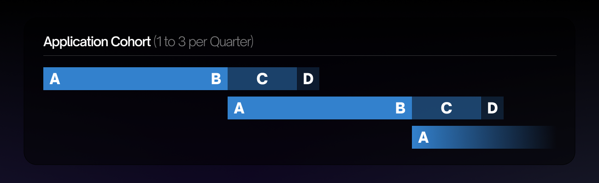

# Grant Phases & Associated Payments
- [Grant Phases & Associated Payments](#grant-phases--associated-payments)
  - [A. Application Review Phase](#a-application-review-phase)
  - [B. Onboarding Phase](#b-onboarding-phase)
  - [C. Milestone Deliverable Phase](#c-milestone-deliverable-phase)
  - [D. Final Deliverable Phase](#d-final-deliverable-phase)
- [Application Review Phase Schedule](#application-review-phase-schedule)
  - [Grants under $25k](#grants-under-25k)
  - [Grants over $25k](#grants-over-25k)
    - [Application Feedback](#application-feedback)
- [Milestone & Final Deliverable Delivery Guidelines](#milestone--final-deliverable-delivery-guidelines)
  - [Submission](#submission)
  - [Content](#content)
  - [License](#license)
  - [Documentation](#documentation)
  - [Formatted code](#formatted-code)
  - [Testing Guide](#testing-guide)
    - [A step-by-step guide demonstrating how your code achieves the milestones](#a-step-by-step-guide-demonstrating-how-your-code-achieves-the-milestones)
    - [Unit Tests](#unit-tests)
    - [Integration Tests](#integration-tests)
    - [Additional Information](#additional-information)
- [Payments](#payments)
  - [Payment Quantity, Milestone Quantity, & Payment Sizing](#payment-quantity-milestone-quantity--payment-sizing)
  - [Payment Notes](#payment-notes)

---

## A. Application Review Phase

The Application Review Phase consists of the following steps:

- Before submitting an application read this document in its entirety, study similar applications [here](https://github.com/stacksgov/Stacks-Grant-Launchpad/issues), and build a relationship with the Stacks community [here](https://github.com/stacksgov/Stacks-Grant-Launchpad/discussions) and [here](https://discord.gg/5usXsXSUAK).
- Submit an application via the [Stacks Foundation Grant Launchpad](https://grants.stacks.org/).
  - _The Grant Launchpad creates a Github issue for your grant application._
  - _After creating your application all interaction, revisions, updates occur on Github._
- Receive informal feedback received from the community on your application via comments on your Github issue.
- Revise your application based on the feedback you receive.
- Wait for the formal review and determinations for your funding round to be announced.
  > For additional details, see [Application Review Phase Schedule](#application-review-phase-schedule)

 

## B. Onboarding Phase

The Onboarding Phase consists of the following steps:

- Grant Lead (aka the Applicant) verifies their identity using a third-party KYC service.
- Grant Lead signs contract and a representative from the Stacks Foundation countersigns contract.
- Initial Payment disbursed at the conclusion of the Onboarding Phase (see [payment notes](#payment-notes)).
- Begin work on your Grant.
- In total, this process can take 1-3 weeks.

 

## C. Milestone Deliverable Phase

Depending on the size of your grant's budget you may either skip this step, or repeat it several times see this [chart](#payment-quantity-milestone-quantity--payment-sizing) for details see [Milestone & Final Deliverable Delivery Guidelines](#milestone--final-deliverable-delivery-guidelines).

Payment approved at the successful completion of each time through this phase.  Payments disbursed within 20 days of approval.

 

## D. Final Deliverable Phase

The Final Deliverable Phase works just like a Milestone Phase for details see [Milestone & Final Deliverable Delivery Guidelines](#milestone--final-deliverable-delivery-guidelines)
Payment approved at the successful completion of this phase.  Payments disbursed within 20 days of approval.
 
 

>Please note once a grant is approved, if an update is not posted within 30 days of the last approval, the grant is considered "Stale".  Once a grant is Stale it must be updated within 60 days or risk being closed.  Once a grant is closed the application is void and needs to be resubmitted.

>We also recommend visiting the [Grants Project Board](https://github.com/stacksgov/Stacks-Grant-Launchpad/grants/) to better visualize the process.

 

# Application Review Phase Schedule

Applications are reviewed in **Groups**. Groups are broken up into two types:

- Applications (under) <$25k *(first time grantees)*
- Applications (over) >$25k *(repeat grantees and/or follow-up grants **only**)*

Each Group consists of four **Sections**:

- **A** : Applications Open Date
- **B** : Applications Close Date
- **C** : Application Review Committee Week
- **D** : Final Decisions & Recap Meeting Date

 

Please note:

- Applications may be _rejected_ during any **Section** of a **Group**.
- Applications will only be _approved_ during the final **Section** of a **Group**.

 

 

---
## Grants under $25k
- Allow for 4-7 weeks to process from the time of submitting an application.
 

| **<$25k Groups** | **A** Date | **B** Date | **C** Date | **D** Date | Number of Weeks |
| :--: | :--:| :--:| :--:| :--:| :--:|
| **Q3-A** | n/a | n/a | n/a | n/a | n/a
| **Q3-B** | n/a | n/a | n/a | n/a | n/a
| **Q3-C** | 8/8/2022 | 9/10/2022 | 9/11/2022 | 9/23/2022 | 7 weeks
| **Q4-A** | 9/11/2022 | 10/15/2022 | 10/16/2022 | 10/28/2022 | 7 weeks
| **Q4-B** | 10/16/2022 | 11/12/2022 | 11/13/2022 | 11/25/2022 | 6 weeks
| **Q4-C** | 11/13/2022 | 12/10/2022 | 12/11/2022 | 12/23/2022 | 6 weeks
|

 

## Grants over $25k
- Allow for 7-9 weeks to process from the time of submitting an application.

_Applications for Grant **over $25k** take between 6-9 weeks to process._

| **>$25k Groups** | **A** Date | **B** Date | **C** Date | **D** Date | Number of Weeks |
| :--------------: | :--------: | :--------: | :--------: | :--------: |:--:|
|     **Q3-A**     |    n/a     |    n/a     |    n/a     |    n/a     | n/a |
|     **Q3-B**     |  8/8/2022  | 9/10/2022  | 9/11/2022  | 9/23/2022  | 7 weeks
|     **Q4-A**     | 9/11/2022  | 10/29/2022 | 10/30/2022 | 11/11/2022 | 9 weeks
|     **Q4-B**     | 10/30/2022 | 12/10/2022 | 12/11/2022 | 12/23/2022 | 8 weeks
|

 

### Application Feedback
- The best way to advance your ideas is to [submit an application](https://grants.stacks.org) and wait for feedback.

- If you have questions regarding the Process or want to discuss specific grant ideas please ask on the [Discussion Board](https://github.com/stacksgov/Stacks-Grant-Launchpad/discussions). 

- If you are having a difficult time visualizing the Process we encourage you to visit the [Grant Kanban Board](https://github.com/stacksgov/Stacks-Grant-Launchpad/projects?type=classic).

- If you feel you require a 1-on-1 meeting to discuss your grant idea, you must first submit an application and request a meeting in the comment section below your grant application GitHub issue. These requests will be accepted on an extremely rare basis. 

 

# Milestone & Final Deliverable Delivery Guidelines

These are the guidelines to be followed for milestone and final deliverables submitted for evaluation.

## Submission

Details of the submission process are still being fine tuned and will be added to this document when they are complete.

## Content

The submission should contain the following information:

- **Name of the grant project**
- **Link to the open-source code/delivery**
- **[License](#license)**
- **[Documentation](#documentation)**
- **[Formatted code](#formatted-code), according to a set of guidelines**
- **[Testing Guide](#testing-guide)**
- **Any [additional information](#additional-information)**

## License

In order to successfully receive grant funding for your application it is necessary for the project to have open source code.
We prefer Apache 2.0, but MIT or Unlicense are also acceptable. If your delivery comprises multiple repositories, make sure to include the license for each of them.

## Documentation

We value high-quality open source code, but even the most performant code is of little use if it lacks proper documentation.

We require that you document (where applicable):

- API calls
- Architecture overview and individual component details
- Algorithms and protocols that are core to your project
- Any other fundamental building blocks to your technology

All documentation must be public and part of the grant-related code repository. This will make it easier for the community to use or adapt your project.

**Note**: Only focus on your **own** contributions. Do not write detailed explanations of already existing components, e.g. IPFS.

## Formatted code

A codebase that is easy to read is also easy to use. We suggest adopting one style from Day 1 and adhering to it across the entire team.
This helps to keep the commit history clean and facilitates any reviews of the introduced changes.

For **Clarity**, we strongly recommend formatting your code according to the [official guidelines](https://github.com/clarity-lang/reference/blob/master/reference.md) and [Clarity Book](https://book.clarity-lang.org/ch13-01-coding-style.html).

For **Rust**, we encourage formatting any additional support libraries or helpers by following the [Style Guidelines](https://doc.rust-lang.org/1.0.0/style/README.html).

For **any other** deliveries, please commit to a particular style & let us know which official guidelines you adopt.

## Testing Guide

We require that each milestone delivery includes a comprehensive test suite, consisting of:

### A step-by-step guide demonstrating how your code achieves the milestones

Please provide documentation on how to install, compile, run and test the deliverable(s). Make sure to include all necessary prerequisites. Common issues while replicating test results involve, among others, undocumented dependencies, version numbers, local database setups, breaking changes in the main branch since delivery, OS- and browser-specific incompatibilities.

Depending on the deliverable, this could include (but is not limited to)

- how to embed your library in another application,
- how to make example API calls to your service,
- running your web app, and
- steps to complete some desired action in your mobile app.

### Unit Tests

As with any quality software project, each logical code component should be testable.

### Integration Tests

We prefer dockerfiles to avoid problems with versions and dependencies.

### Additional Information

Provide any addition information you see fit at the bottom of your deliverable.

**Note**: If you are not delivering code as part of your project, such a test suite is not applicable. This mainly applies to projects centering on design, research or hardware. If that is the case, please provide detailed instructions on how else we can test/run/replicate your deliverable. 

 

# Payments

## Payment Quantity, Milestone Quantity, & Payment Sizing

| **GRANT BUDGET** | **NUMBER OF PAYMENTS** | **NUMBER OF MILESTONES** | **% OF BUDGET PER PAYMENT** |
| :-- | :--:| :--:| --:
| $0 to $9,999                                       |           2            |            0             |                         50% |
| $10k to $24,999                                    |           3            |            1             |                       33.3% |
| $25k to $59,999                                    |           4            |            2             |                         25% |
| $60k to $99,999                                    |           5            |            3             |                         20% |
| $100k to $149,999                                  |           6            |            4             |                       16.6% |
| $150k to $250k                                     |           8            |            6             |                       12.5% |
| Residents, Chapters, Direct Investments over $250k |           12           |            10            |                        8.3% |
|

## Payment Notes

1. Please note that while the total grant budget is requested for in U.S. Dollars (USD) all payments (*without exception*) are made in Stacks (STX).
2. The quantity of STX disbursed with each payment is calculated using a 7-day trailing average from the time each payment is approved. Quantities can be confirmed [here](https://grants.stacks.org/stacks-payment-converter)
3. All payments are disbursed at the successful **conclusion** of each grant phase, as outlined [here](#a-application-review-phase).
4. All payments will be disbursed within **20 days** of each successfully completed grant phase.

 

Continue to [Grant Application Guidelines](Grant-Aplication-Guidelines)